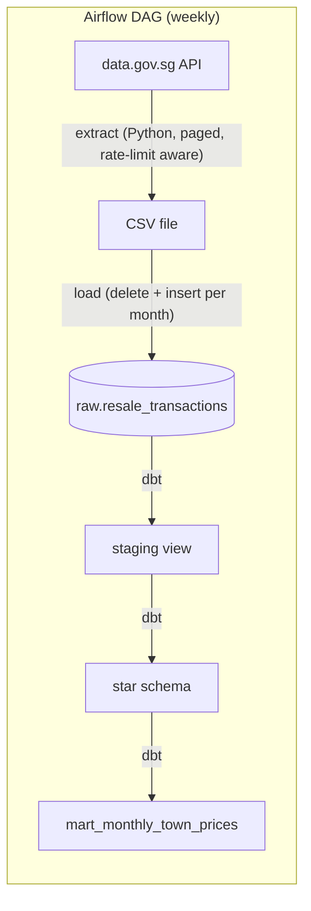
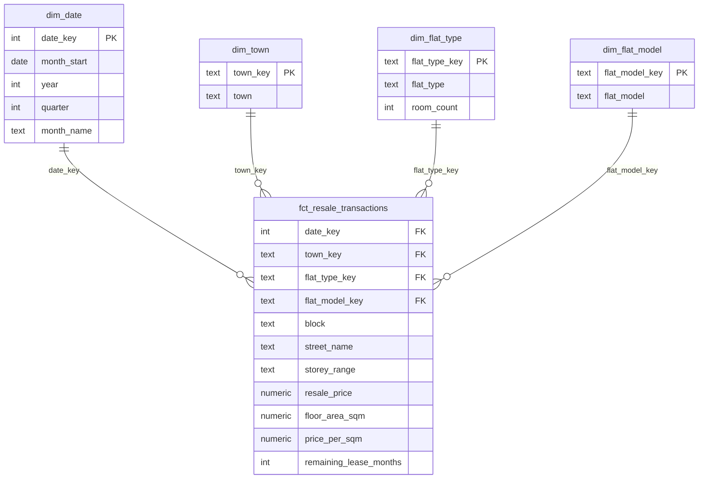

# HDB Resale Analytics Pipeline

[](https://github.com/Mohariz999/hdb-resale-pipeline/actions/workflows/ci.yml)

An end-to-end batch data pipeline on Singapore public data. Airflow pulls HDB resale flat transactions from data.gov.sg every week and loads them into PostgreSQL, and dbt models them into a tested star schema with a monthly price mart on top. Everything runs in Docker, and every push builds and tests the models in GitHub Actions.

**Stack:** Apache Airflow 3 · dbt Core · PostgreSQL 16 · Python · Docker Compose · GitHub Actions
**Data:** [Resale flat prices based on registration date, Jan 2017 onwards](https://data.gov.sg/datasets/d_8b84c4ee58e3cfc0ece0d773c8ca6abc/view) (data.gov.sg), about 220,000 transactions

## Highlights

- **Incremental and idempotent loads.** Each weekly run reloads the current and previous month with delete-then-insert in one transaction, so reruns never duplicate rows and late registrations are picked up.
- **One-off backfill.** The same DAG takes a `start_month` / `end_month` range to load all history since 2017.
- **Star schema in dbt.** A fact table of sales, four dimensions and a monthly mart, so "4-room price per sqm in Tampines last year" is one simple query.
- **31 data tests on every run.** Unique and not-null keys, accepted values, fact-to-dimension relationships and a custom price check. A bad row fails the run instead of reaching a dashboard.
- **CI on every push.** GitHub Actions starts a Postgres container, loads a sample, and runs the full `dbt build` with tests.

## Findings

*Data as of 6 Oct 2026. Prices are average resale price per square metre, from `mart_monthly_town_prices`.*

**Resale prices rose about 52% from 2017 to 2025, and nearly all of that came after 2020.**

| Year | Sales | Avg price per sqm (SGD) |
|---|---:|---:|
| 2017 | 20,509 | 4,579 |
| 2019 | 22,186 | 4,477 |
| 2020 | 23,333 | 4,670 |
| 2021 | 29,087 | 5,249 |
| 2023 | 25,754 | 6,071 |
| 2025 | 25,085 | 6,954 |
| 2026 (to Oct) | 19,965 | 7,005 |

- **Flat, then a surge.** Prices were flat from 2017 to 2019 (down 2%), then rose 12% in 2021 alone, when sales also hit their peak of 29,087.
- **Growth is slowing.** 2026 so far is only about 1% above 2025, after 7% growth in 2025.
- **Outer towns caught up.** For 4-room flats, the biggest rises from 2017 to 2025 were in non-central towns: Sembawang (+80%), Pasir Ris and Hougang (+65%), and Woodlands (+64%). Mature central towns rose least: Marine Parade (+27%), Bukit Timah (+29%) and Bishan (+34%).
- **The gap narrowed.** In 2017, a 4-room flat in the Central Area cost 2.4× as much per sqm as one in Choa Chu Kang, the cheapest town. By 2025 that was 2.1×. Queenstown and the Central Area now pass $10,000 per sqm.

*Caveat: these are simple averages, not adjusted for flat age or remaining lease, so part of the change reflects which flats were sold each year.*

## Architecture



The DAG has three tasks: `extract` → `load` → `dbt_build`. Each retries twice before the run fails, and `dbt_build` fails the run if any data test fails.

## Data model

A star schema: one fact table of sales in the middle, four dimensions around it, and a mart on top for dashboards.



`mart_monthly_town_prices` aggregates the fact to one row per month, town and flat type: number of sales, median and average price per sqm, and median price.

## Data quality

Tests run as part of every `dbt build`. A failing test stops the models that depend on it.

| Layer | Tests |
|---|---|
| Staging | `not_null` on month, town, flat type, model, floor area and price. `accepted_values` on flat type (HDB's seven types). |
| Dimensions | `unique` and `not_null` on every key and name. |
| Fact | `not_null` and `relationships` from each key to its dimension, so no sale is lost in a join. |
| Custom | `assert_positive_price_and_area`: no sale with a zero or negative price or floor area. |

## Design decisions

- **Raw is all text.** The load stores exactly what the API sent, and all casting happens in one dbt staging model. A bad value never fails the load, and the cleaning logic lives in one place.
- **A rolling two-month window.** data.gov.sg updates monthly data daily, and late registrations can land in the previous month. Reloading both months keeps them complete without reloading history.
- **Hashed surrogate keys.** Dimension keys are `md5` of the natural key, so the fact and the dimensions compute matching keys independently, and keys stay stable across rebuilds.
- **Median as the headline metric.** A few very expensive flats skew averages, so the mart reports median price per sqm. It also stores a sum next to each average, so months roll up into a true yearly average.

## Run it yourself

The easiest way is GitHub Codespaces, which has Docker ready to go.

1. **Code → Codespaces → Create codespace on main**, then wait for setup to finish.
2. Start the stack: `docker compose up -d --build` (the first build takes a few minutes).
3. Open the **Ports** tab → port **8080** for the Airflow UI. There's no login in local dev mode.
4. Load history: unpause `hdb_resale_pipeline`, then trigger it with `start_month` = `2017-01`. This takes about 20–25 minutes.
5. Query the results: `docker compose exec warehouse psql -U hdb -d hdb`, then for example
   ```sql
   select year_month, town, flat_type, transactions, median_price_per_sqm
   from marts.mart_monthly_town_prices
   where town = 'Tampines' and flat_type = '4 ROOM'
   order by year_month desc
   limit 12;
   ```

After that, the weekly schedule keeps the latest two months up to date. An optional data.gov.sg API key in `.env` (`DATA_GOV_SG_API_KEY=...`) raises the rate limit and roughly halves the backfill time.

## Project structure

```
dags/hdb_resale_pipeline.py   Airflow DAG: extract, load, dbt build
dbt/models/staging/           Typed, cleaned view over the raw table
dbt/models/marts/             Star schema (fact + 4 dimensions) and the monthly mart
dbt/tests/                    Custom data tests
ci/                           Sample data and setup for the CI database
airflow/Dockerfile            Airflow image with dbt in its own virtualenv
docker-compose.yml            Airflow, its metadata DB, and the warehouse
```

## What's next

- **Public dashboard.** A scheduled GitHub Actions workflow exports the mart to a small file, and a Streamlit app on Streamlit Community Cloud reads it, so the public link updates weekly by itself.
- **Local BI.** Metabase as one more container next to Airflow, reading the mart directly.
- **Cloud warehouse.** Swap Postgres for BigQuery. Only the dbt profile and a few SQL functions would change.

## Useful commands

| What | Command |
|---|---|
| Start everything | `docker compose up -d --build` |
| Stop (keep data) | `docker compose down` |
| Stop and wipe all data | `docker compose down -v` |
| Airflow logs | `docker compose logs -f airflow` |
| SQL shell on the warehouse | `docker compose exec warehouse psql -U hdb -d hdb` |
| Run dbt from the terminal | `cd dbt && dbt build` |

Warehouse connection for a SQL client: `localhost:5433`, user `hdb`, password `hdb`, database `hdb`.
