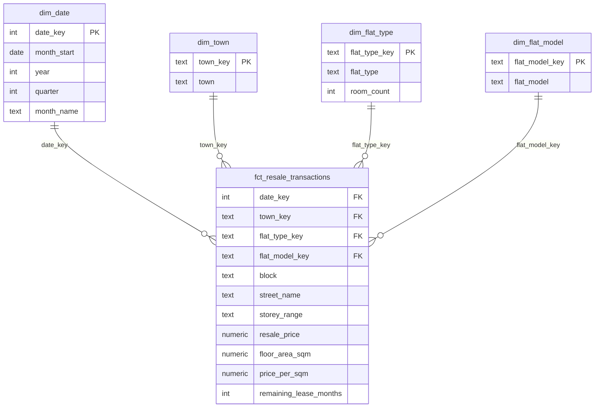

# HDB Resale Analytics Pipeline

An end-to-end data pipeline on Singapore public data: Airflow pulls HDB resale transactions from data.gov.sg every week, loads them into PostgreSQL, and dbt models them into a tested star schema. Everything runs in Docker.

```
data.gov.sg API ──► Airflow DAG (weekly)
                      1. extract  → current + previous month (Python)
                      2. load     → raw.resale_transactions (PostgreSQL, idempotent)
                      3. dbt build → staging → star schema → marts, plus data tests
```

**Stack:** Apache Airflow 3 · dbt Core · PostgreSQL 16 · Docker Compose · GitHub Actions
**Data:** [Resale flat prices based on registration date, Jan 2017 onwards](https://data.gov.sg/datasets/d_8b84c4ee58e3cfc0ece0d773c8ca6abc/view) (data.gov.sg)


## Data model

A star schema: one fact table of sales in the middle, four dimensions around it, and a mart on top for dashboards.



`mart_monthly_town_prices` aggregates the fact to one row per month, town and flat type: number of sales, median and average price per sqm, and median price.

---

## Build plan

Work through the phases in order. Each one ends with a clear "done when" check. Commit after every phase.

### Phase 0 · Get it running (about 30 min)
- [ ] Open this repo in a Codespace: **Code → Codespaces → Create codespace on main**. Wait for setup to finish (a few minutes the first time).
- [ ] In the terminal: `docker compose up -d --build` (first build takes 3–5 min).
- [ ] Open the **Ports** tab → port **8080** → Airflow UI. No login needed (local dev mode).
- [ ] Unpause and trigger the **smoke_test** DAG.
- [ ] When you're finished for the day: Codespaces menu → **Stop Codespace** (saves your free hours).

**Done when:** both `smoke_test` tasks are green, and the `check_warehouse` log lists a `raw` schema.

### Phase 1 · Extract and load (you write this)
File: `dags/hdb_resale_pipeline.py`
- [ ] Open the API URL in your browser and study the JSON: fields, how to filter by month, how paging works.
- [ ] Create `raw.resale_transactions` (all columns `TEXT` + `loaded_at TIMESTAMP`).
- [ ] Write `extract()`: work out the current and previous month from the run date, call the API, page through all results, save a CSV.
- [ ] Write `load()`: insert the CSV into the raw table, **idempotently** (delete those months' rows, then insert, in one transaction).
- [ ] Trigger the DAG and check: `select month, count(*) from raw.resale_transactions group by 1;`
- [ ] Trigger it **again**. The counts must not go up (only change if new data arrived).

**Done when:** two months are loaded, and rerunning doesn't duplicate rows.
**Interview line:** "The source is monthly but updated daily, so my weekly DAG reloads a rolling two-month window idempotently. Late records get picked up, and reruns never duplicate."

### Phase 2 · dbt staging (you write this)
Folder: `dbt/models/staging/`
- [ ] `stg_resale_transactions.sql`: select from `{{ source('raw', 'resale_transactions') }}`, cast types (dates, numbers), clean text, add `price_per_sqm`, convert `remaining_lease` ("61 years 04 months") into months.
- [ ] Run from the terminal: `cd dbt && dbt build`

**Done when:** `select * from staging.stg_resale_transactions limit 10;` shows clean, typed data.

### Phase 3 · Star schema and mart (you write this)
Folder: `dbt/models/marts/`
- [ ] Dimensions: `dim_town`, `dim_flat_type`, `dim_flat_model`, `dim_date` (one row per month)
- [ ] Fact: `fct_resale_transactions` (one row per transaction, foreign keys to each dimension, plus measures: price, floor area, price per sqm, remaining lease)
- [ ] Mart: `mart_monthly_town_prices` (median price per sqm and transaction count, by town and month). This is your reusable business metric.
- [ ] Draw the schema (fact in the middle, dimensions around it) and add the image to this README.

**Done when:** you can answer "average 4-room price per sqm in Tampines last year" with one simple query on the mart.
**Interview line:** be ready to explain why each column belongs in the fact table or a dimension.

### Phase 4 · Tests and full orchestration
- [ ] Add a `schema.yml` per folder with tests: `unique` + `not_null` on keys, `accepted_values` on flat types, `relationships` from fact to dimensions.
- [ ] Add one custom test in `dbt/tests/` (e.g. no `resale_price <= 0`).
- [ ] The DAG already runs `dbt build` after `load`. Add `retries` to your tasks.
- [ ] Load history: write a one-off backfill (e.g. a `months` parameter on the DAG, or a separate script) for Jan 2017 onwards. Check the counts per month.
- [ ] Break something on purpose (e.g. insert a bad row) and watch the test catch it.

**Done when:** a full DAG run loads, builds, and tests green, and a bad row makes it fail.

### Phase 5 · CI and polish
- [ ] Extend `.github/workflows/ci.yml`: add a Postgres service container, load a small sample CSV, and run `dbt build` on every push.
- [ ] Finish this README: the architecture diagram, how to run it, the schema image, and a short "What I learned / what I'd do next" section.
- [ ] Add 2–3 dashboard screenshots and a short dated **Findings** section (e.g. "Oct 2026: price per sqm in X rose Y% year on year"), so a recruiter sees the insights without running anything.
- [ ] Pin the repo on your GitHub profile and add the link to your CV.

**Done when:** a pull request shows a green CI check, and a stranger could run the project from the README alone.

### Phase 6 · Public dashboard and extras
**Public dashboard** (reuses the Phase 5 CI work)
- [ ] Add a scheduled GitHub Actions workflow (weekly) that loads the data, runs `dbt build`, and exports `mart_monthly_town_prices` to a small Parquet/CSV file committed to the repo.
- [ ] Build a Streamlit app that reads that file and host it free on Streamlit Community Cloud. It redeploys on every new file, so the public link updates weekly by itself.
- [ ] Metabase (free) stays as the local dashboard, one more container next to Airflow, reading the mart directly.

**Other options**
- Swap Postgres for BigQuery (GCP free tier) to match GCP-based JDs, with Looker Studio as a public dashboard alternative
- Trigger your Databricks project from Airflow

---

## Useful commands
| What | Command |
|---|---|
| Start everything | `docker compose up -d --build` |
| Stop (keep data) | `docker compose down` |
| Stop and wipe all data | `docker compose down -v` |
| Airflow logs | `docker compose logs -f airflow` |
| SQL shell on the warehouse | `docker compose exec warehouse psql -U hdb -d hdb` |
| Run dbt from the terminal | `cd dbt && dbt build` |

Warehouse connection for a SQL client: `localhost:5433`, user `hdb`, password `hdb`, database `hdb`.
